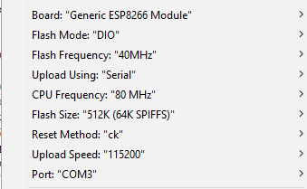

# Sonoff
Alternative firmware for the itead Sonoff based on the Arduino port for the ESP8266

## Features
### Common
#### Relay control with eco mode to reduce power consumption
Relays need less current one they are fully switched on. PWM is used here to reduce the current after a period of time which is needed to turn the relay on. If you experience switching off of the relay if it should stay on the reduction parameter has to be increased. please see Sonoff.h and relay.h for further info.

**If you have pets at home** please be aware that they might hear the PWM frequnecy of currently 25kHz. Please set the reduction paramter to 1.0, which switches off the eco mode but will keep your pets at peace. 
#### Switch reading with debouncing and events
### Sonoff Webserver
* Control the relay through the webpage found under http://sonoff.local

## Settings for the Arduino IDE

First I had a strange behavior:
* Serial working 
* GPIO working
* **and Wifi was not connecting**.

Thanks to Leonzio who posted here http://tech.scargill.net/itead-slampher-and-sonoff/#comment-13634 I figured out that I also had the wrong flash size set. 

Flash size to set for a generic module in the Arduino IDE is 512k for the V1.0 hardware. Even if the chip says 1M bit.

Also be aware that OTA is not support with that little flash. Tried it but it will **not** advertise itself and never shows up in the list of OTA devices.

Here the working setting for the Arduino ESP8622 2.0 IDE

## Helpfull links
* https://github.com/esp8266/Arduino
* http://www.esp8266.com/wiki/doku.php?id=esp8266_gpio_pin_allocations
* http://wiki.iteadstudio.com/images/6/6b/Sonoff_schmatic.pdf
* http://www.john-lassen.de/index.php/projects/esp-8266-arduino-ide-webconfig
* https://github.com/bblanchon/ArduinoJson
* https://github.com/knolleary/pubsubclient
